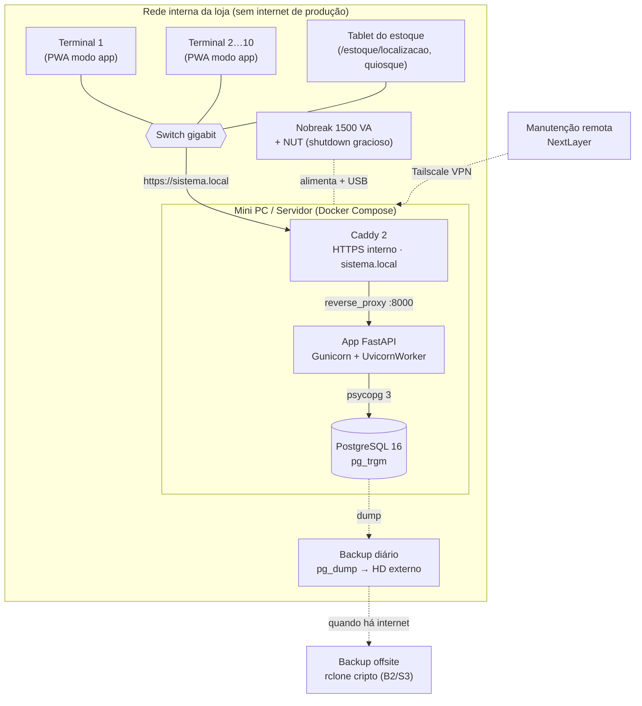
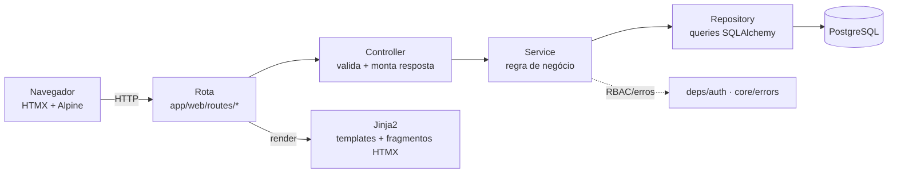

# Estrela Gestão — Sistema de Estoque e Pedidos (Local)

Sistema **100% local e offline** de controle de estoque e pedidos para a **Estrela América do Sul**.
Backend **Python / FastAPI** · interface **Jinja2 + HTMX + Tailwind** · **PostgreSQL** · PWA (modo aplicativo).

## Estado: Fase 1 implementada

Auth/RBAC · cadastros (produtos/clientes/usuários) · estoque (movimentações append-only, inventário,
localização/tablet) · ETL da planilha `CONTROLE.xlsx` · pedidos (reserva→baixa→estorno, separação,
impressão) · financeiro (contas a receber, baixas, relatórios + export XLSX) · dashboard · PWA · infra de
produção (Docker/Caddy/backup/runbooks).

## Documentação

- **`docs/fluxo-sistema-estrela-gestao.pdf`** — demonstração visual do fluxo real (telas + como funciona).
- **`docs/documentacao-tecnica-estrela-gestao.pdf`** — documentação técnica completa (regras, modelo de
  dados, ETL, módulos, infra) consolidada em um único PDF.
- **`docs/*.md`** — os mesmos documentos técnicos em Markdown, por frente.

## Infraestrutura (produção no cliente)

100% local: um mini PC roda toda a stack em Docker; até 10 terminais acessam pela rede interna em modo
aplicativo (PWA) via HTTPS interno do Caddy. Sem exposição à internet — manutenção remota só por Tailscale.



## Arquitetura da aplicação (4 camadas)

Toda feature segue **Rota → Controller → Service → Repository → Model**. A camada de _services_ concentra a
regra de negócio e já nasce pronta para expor JSON na Fase 2 (catálogo/WhatsApp).



## Setup de desenvolvimento

Pré-requisitos: **Python 3.12** (via `uv`), **PostgreSQL** e o binário **Tailwind standalone**.

```bash
# 1. Dependências
uv sync

# 2. Banco (PostgreSQL) — crie role/banco e copie o .env
cp .env.example .env            # ajuste DATABASE_URL/JWT_SECRET se necessário
#   role 'estrela' / db 'estrela_gestao' devem existir (ver docker-compose.yml p/ os valores)

# 3. Migrations + dados de exemplo
uv run alembic upgrade head
uv run python scripts/seed.py   # usuários por perfil (senha: estrela123), 7 categorias, produtos

# 4. CSS (Tailwind standalone, sem Node) — baixe o binário ./tailwindcss e gere o output
./tailwindcss -i app/static/css/input.css -o app/static/css/output.css --minify
#   (use --watch durante o desenvolvimento)

# 5. Rodar (WeasyPrint, se usado, precisa das libs nativas — DYLD no macOS)
DYLD_FALLBACK_LIBRARY_PATH=/opt/homebrew/lib uv run uvicorn app.main:app --reload
```

Acesse `http://localhost:8000` → login `admin@estrela.local` / `estrela123`.

## Comandos úteis

```bash
uv run pytest                                   # testes (307)
uv run ruff check . && uv run ruff format .     # lint + format
uv run alembic revision --autogenerate -m "msg" # nova migration
uv run alembic check                            # confere se o modelo bate com a última migration

# Importar planilha (ETL) — valida (dry-run) e depois carrega (idempotente)
uv run python scripts/import_planilhas.py --file data/CONTROLE.xlsx --dry-run
uv run python scripts/import_planilhas.py --file data/CONTROLE.xlsx
```

A importação recorrente também está disponível na tela **/importacao** (admin: upload → prévia → confirmar).

## Produção

`docker-compose.prod.yml` (app + Postgres 16 + Caddy HTTPS interno), `Dockerfile`, `Caddyfile`,
scripts de backup/restore em `scripts/` e runbooks em `docs/` (`runbook-servidor.md`,
`go-live-checklist.md`, `disaster-recovery.md`, `lgpd-operador.md`, `nobreak-nut.md`).

## Estrutura

- **`CLAUDE.md`** — contexto-raiz e padrões (4 camadas, RBAC, estoque append-only, Decimal).
- **`docs/`** — planejamento por frente (marcos 00–08 + `dicionario-dados.md`).
- **`app/`** — `core/` (config, db, security, errors, templates), `deps/` (db, auth/RBAC),
  `models/`, `schemas/`, `repositories/`, `services/`, `controllers/`, `web/routes/` + `web/templates/`,
  `static/` (PWA: manifest, sw.js, ícones; htmx/alpine/tailwind locais), `importer/` (ETL).
- **`tests/`** — fluxos críticos (estoque, pedidos, RBAC, importador, financeiro).
